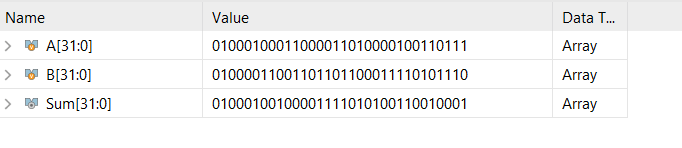
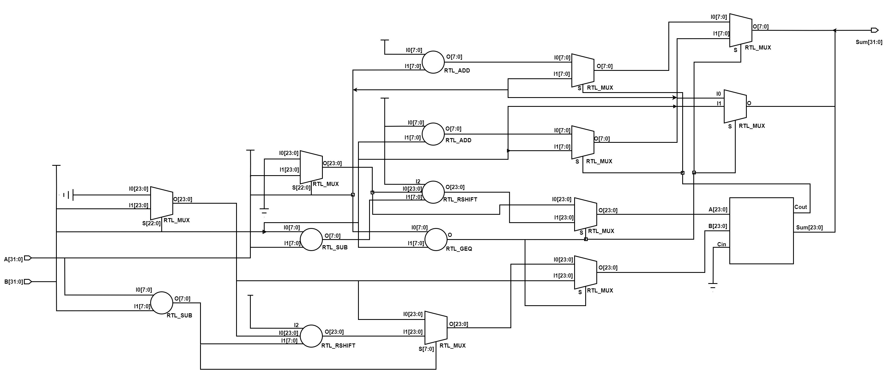

# Power_Efficiant_FloatingPoint_Adder
 Floating-point addition is a fundamental and basic operation in various applications of computer architecture,
 but it often consumes significant power, area, and delay. Optimizing the mantissa addition, a key component of floating-point addition
 can lead to significant improvements.
 we propose a hybrid RCA-CLA mantissa adder that adds the mantissa in the single precision floating point format using both
 ripple carry adder (RCA) and carry look-ahead adder (CLA).

Pre-requisites
--------------

- Verilog
## Designing a Single Precision Floating Point Adder in Verilog
Designing a Single Precision Floating Point Adder in Verilog involves implementing the logic to perform addition on 
floating-point numbers encoded in the IEEE 754 standard format. Here's a general explanation of the design process:

1. Define the Input and Output Ports:
   - Inputs: Two single-precision floating-point numbers (A and B) encoded in IEEE 754 format.
   - Outputs: The sum of the two numbers (Result) encoded in IEEE 754 format.

2. Decode IEEE 754 Format:
   - Extract the sign bit, exponent, and mantissa from both input numbers.
   - Normalize the mantissas by adding an implicit leading bit to the mantissa value.

3. Align Exponents:
   - Compare the exponents of the two input numbers to determine the larger exponent.
   - Shift the mantissa of the number with the smaller exponent to align the exponents.

4. Perform Addition:
   - Add the aligned mantissas together, considering the sign and overflow conditions.
   - Adjust the exponent based on the normalization and rounding requirements.
   - Handle cases where the result overflows or underflows the range of the floating-point representation.

5. Normalize Result:
   - Normalize the resulting mantissa by shifting it and adjusting the exponent accordingly.
   - Round the mantissa if necessary, considering the rounding mode specified in IEEE 754.

6. Encode Result:
   - Determine the sign bit based on the signs of the input numbers and the result.
   - Encode the normalized mantissa and exponent into the IEEE 754 format.

7. Test and Verify:
   - Create testbenches to simulate various floating-point addition scenarios.
   - Validate the correctness of the design by comparing the expected results with the actual outputs.

8. Synthesize and Implement:
   - Once the design is verified, it can be synthesized using a synthesis tool.
   - Use a tool like Yosys, Synopsys Design Compiler, or Xilinx Vivado to generate the gate-level netlist.

It's important to note that the actual implementation of a Single Precision Floating Point Adder may require additional considerations, such as handling special cases (e.g., NaN, infinity), rounding modes, and exceptional conditions (e.g., denormalized numbers). The complexity of the design may vary based on the desired level of accuracy and performance requirements.

Additionally, when designing complex arithmetic circuits like floating-point adders, it is often beneficial to use predefined arithmetic modules available in synthesis libraries or intellectual property (IP) cores, as they have been optimized and validated for efficient and accurate computation.

## Demo

## Features

- Hybrid 24Bit AAdder.
- Carry look ahead 4Bit adder.
- Ripple carry adder 4Bit.
- Ripple carry adder 20Bit.
- Floating point adder.
- test bench

## Results

The Verilog code in simulated in Xilinx Vivado 2022.2. The synthesis operation is performed in Cadence RTL compiler and different circuit parameters like area, power, and delay are estimated using TSMC 180nm technology. The estimated results are given in the following 
- Power(nW)           : 1.361
- Area(micrometer.s)  : 9433
- Delay(ps)           : 13596.79
- PDP                 : 9990.3  
- PDA                 : 12825.85

## Authors

- [@hemu33662](https://github.com/hemu33662)
